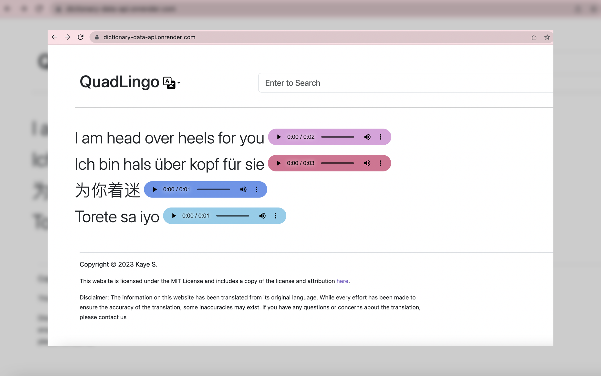

# QuadLingo Dictionary

## Overview


View Demo: https://dictionary-data-api.onrender.com

QuadLingo is a user-friendly tool for searching slangs and their meanings in English, Deutsch, Mandarin and Tagalog.
This app serves as a basic application of the Flask Framework using Google Sheets as its source of information and easy deployment on Render. Google Sheets as a database offers non-developers a simple, accessible, and cost-effective solution for storing and managing non-sensitive data. It allows you to revise the data items directly using Google sheets. For a Flask setup that will process sensitive data, [view this project instead](https://github.com/kayesokua/flask-store-dummy).

## Package Requirements
1. `Flask` provides a simple and flexible way to build web applications. Without Flask, you would have to write low-level code to handle HTTP requests, handle routing, and handle templates, among other things.
2. `gTTS` generates text-to-speech using Google Translate
3. `gunicorn` is a production-ready HTTP server for Python web applications. Flask, by itself, is not designed to be used in production and is only meant to be used for development purposes.
4. `jsons`  to parse the data received from the Google Sheets API
5. `urllib3`makes an HTTP request to the Google Sheets API

## Run the Application on Local Environment
1. Clone repository `git clone https://github.com/kayesokua/flask-dictionary flask-dir`
2. Go to the new directory`cd flask-dir`
3. Install required modules `pip3 install -r -requirements.txt`
4. Run the application `flask run`

## How to Use

### Get API JSON
*  `https://dictionary-data-api.onrender.com/api/json/` to to get all items in the dictionary
*  `https://dictionary-data-api.onrender.com/api/json/<int>` to get 1 item detail

### Modify Dictionary
Currently the app does not have a single page to configure the contents of the dictionary, but here is the list of instructions on how you can modify the content.

1. Create a new spreadsheet using Google Sheets. The columns represent the key names and the rows will be the dictionary's items. [Follow this format](https://docs.google.com/spreadsheets/d/1b-ri2DlWLIhqB-E8xUCqnh9fsxJJ5J-KGV52rJ250Dk/edit#gid=81166623)

2. Publish the spreadsheet to the web and get the generated end point `https://spreadsheets.google.com/feeds/cells/<your_google_sheet_code>/<sheet_page_no>/public/full?alt=json`

3. In the `app.py` file, change the url source.
```python
self.dictionary_url = "<your google sheet json url>"
```

4. In the `app.py` file, Change the key values according to your database.
```python
    random_item = {
        "type": self.dictionary_data[i][0],
        "en": self.dictionary_data[i][1],
        "de": self.dictionary_data[i][2],
        ...
```
For example, if you have korean and japanese:
```python
    random_item = {
        "type": self.dictionary_data[i][0],
        "ko": self.dictionary_data[i][1],
        "jp": self.dictionary_data[i][2],
        ...
```
This is the same for the variable `result` which you will find in the `get_json_one()` function.

5. Go to templates `templates/home.html` and change the key names according to your database:
For example:
```html
 <p class="display-6">{{ random['en'] | capitalize }}
    <audio src="{{ url_for('generate_speech_url', lang='en', text=random['en'] ) }}" controls="true" class="audio-1"></audio>                            
</p>
```
into this:
For example:
```html
 <p class="display-6">{{ random['ko'] | capitalize }}
    <audio src="{{ url_for('generate_speech_url', lang='ko', text=random['ko'] ) }}" controls="true" class="audio-1"></audio>                            
</p>
```
This is the same for the variable `result` which you will find in the same file.

6. (Optional) This template also uses tooltip for pronunciation reference. If your dictionary need it, simply add this snippet into the paragraph element.

```html
<span data-bs-toggle="tooltip" data-bs-title="{{ result[4] }}">{{ result[3] }}</span>
```
7. In the `templates/header.html` file, you will find the linked menu elements. Revise the links according to your application. For example, change the google forms link.
```html
<a class="dropdown-item" href="https://forms.gle/Ruxwt2GVXjHUKnKT6" target="_blank">Contribute Words<svg width="16" height="16"><use xlink:href="#google" /></svg></a>
```
8. In the `templates/footer.html` file, you will find the copyright and license content.

### Deploy Your App
1. After all the changes, commit all your changes in your own github repositor.
2. Create a new Web Service on Render, and give Render permission to access your new repo.
3. Use the following values during creation:
* Environment: Python
*  Build Command: `pip install -r requirements.txt`
* Start Command: `gunicorn app:app`

## Resources 
1. [Flask Documentation](https://flask.palletsprojects.com/en/2.2.x/)
2. [Bootstrap 5 Documentation](https://getbootstrap.com/docs/5.3/getting-started/introduction/)
3. [Google Sheet as a JSON Endpoint](https://www.freecodecamp.org/news/cjn-google-sheets-as-json-endpoint/)
4. [Deploy a Flask App on Render](https://render.com/docs/deploy-flask)
